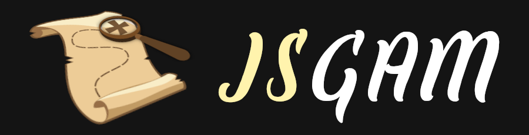

# JavaScript Adventure Game Maker

A game engine inspired on classic graphical point-and-click adventure games made for XXI century.

## Getting started
Read [this tutorial](https://kreezii.github.io/jsgam/tutorial.html) to get started.

JSGAM is available via GitHub, NPM and CDNs:

### GitHub
- Clone the git repository via [https](https://github.com/kreezii/jsgam.git)
- Download the build files: [jsgam.js](https://github.com/kreezii/jsgam/blob/master/dist/jsgam.js) and [jsgam.min.js](https://github.com/kreezii/jsgam/blob/master/dist/jsgam.min.js)

### NPM
- Install [node.js](https://nodejs.org)
- Clone or download [jsgam-template](https://github.com/kreezii/jsgam-template)
- Run ```npm install```

### CDN
JSGAM is on jsDelivr. Include the following in your html:
```html
<script src="https://cdn.jsdelivr.net/npm/jsgam@latest/dist/jsgam.min.js"></script>
```

## Author

* **R.Vañes**

## Built With

* [PixiJS](http://www.pixijs.com/)
* [Pixi-Layers](https://github.com/pixijs/pixi-display)
* [GSAP](https://greensock.com/gsap)
* [Howler](https://howlerjs.com/)
* [DragonBones](http://dragonbones.com/)
* [LocalForage](https://github.com/localForage/localForage)
* [PolyK](http://polyk.ivank.net/)
* [Walkable](https://github.com/implicit-invocation/walkable)
